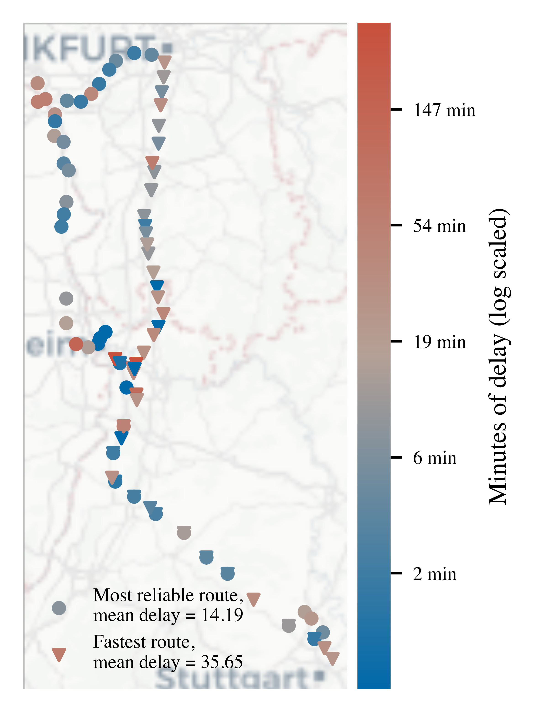
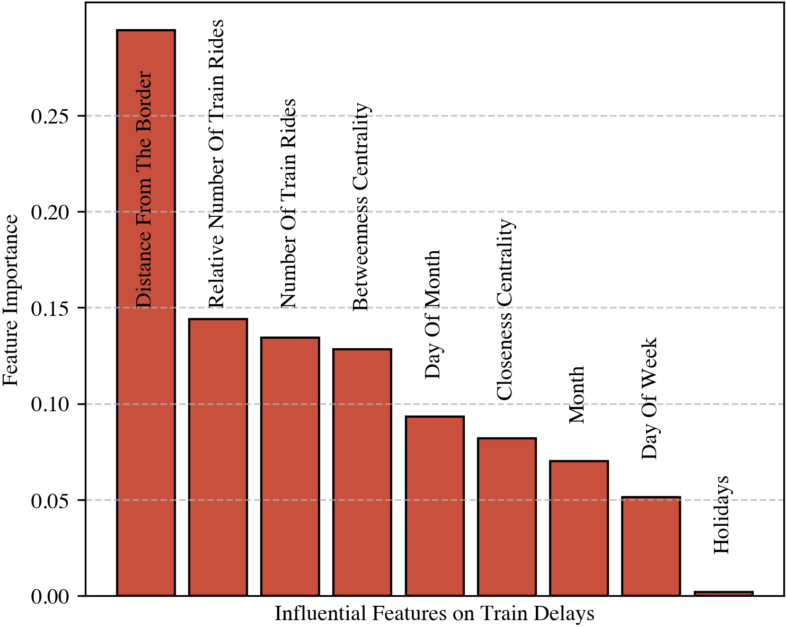
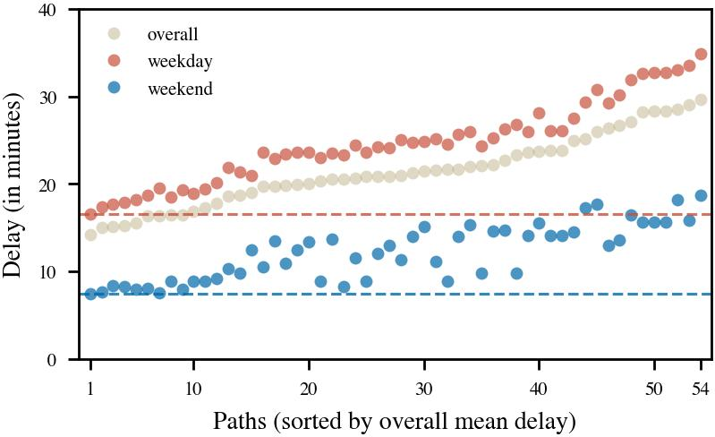

# Are You Still Booking Train Tickets Under the Assumption of No Delays?

  

This repo contains the code used for a project to find the most reliable train route going from Stuttgart to Frankfurt (Main) as part of the lecture *Data Literacy* at the University of Tuebingen.

---

The optimized route has less than half the delay of the fastest proposed route by Deutsche Bahn. The most important factors contributing to the delay of a given station are the distance of the station to the border and the (relative) number of train rides at the station.

  
  

Trains are a more delayed on weekdays than on weekends. However, the optimal route is the most reliable no matter when you travel.

  

## Structure

You will find the data we used in the directory `.\dat`, the experiments we conducted in `.\exp`, and the report and (even more) figures in `.\doc`.
